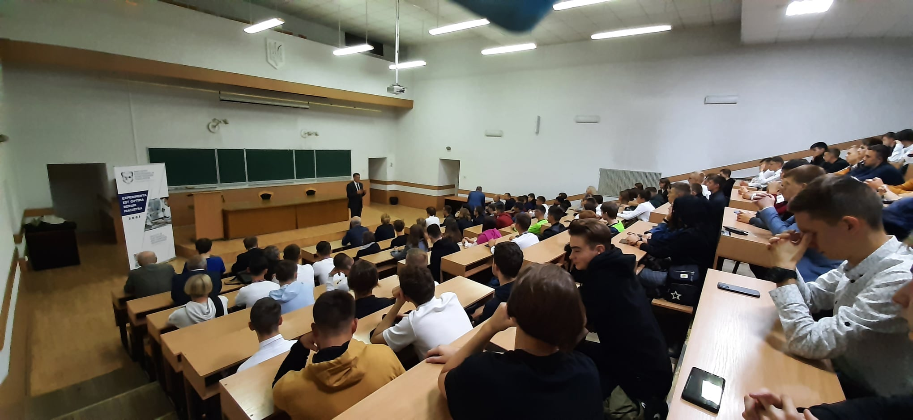
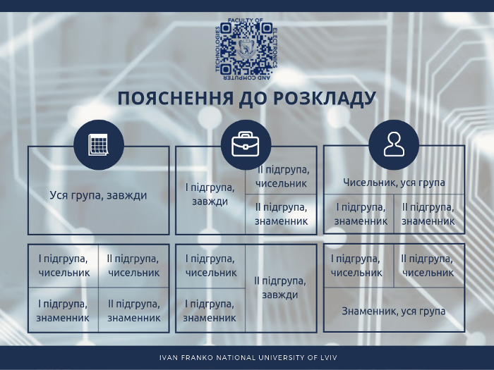
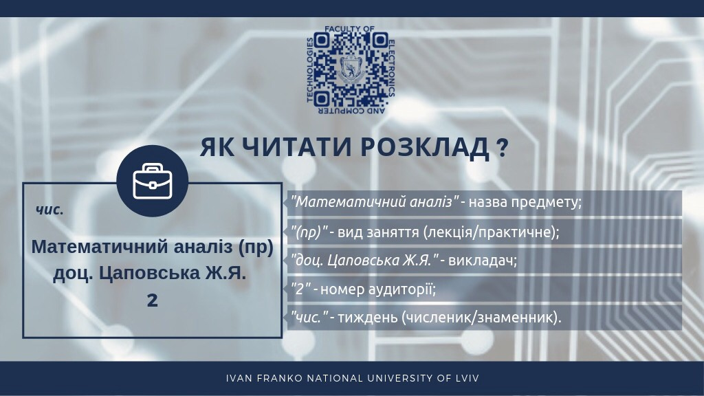
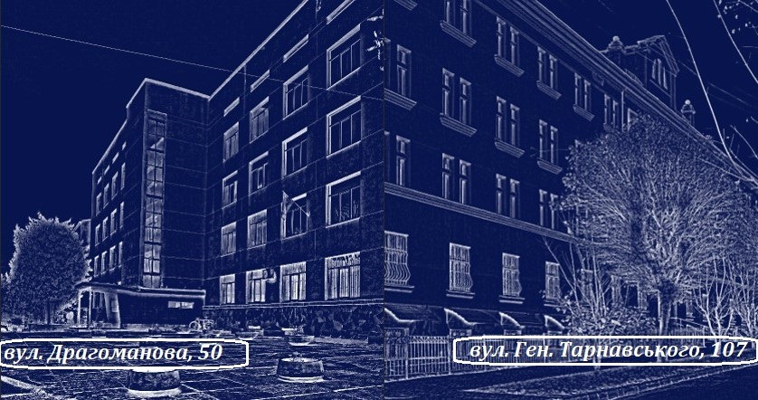
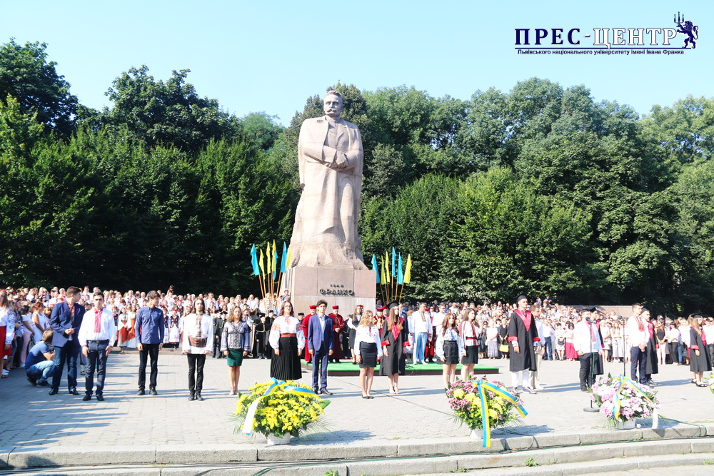

# Навчання, сесія і стипендії
Мабуть, найважливішим, що ми можемо вам розповісти - є те, як на нашому факультеті організовано навчальний процес, а також на які моменти варто одразу ж звернути увагу, щоб мати чудову академічну успішність. Що ж, спробуємо розповісти про все і одразу, але так, щоб це було просто і зрозуміло. Вмощуйтесь зручніше, далі піде лонгрід :smile:.

<figure markdown>
  { width="100%" }
  <figcaption>Урочиста церемонія з нагоди початку навчального року</figcaption>
</figure>

## Розподіл за групами
Перше, що чекає на вас після вступу на наш факультет - це розподіл за академічними групами. Він проходить автоматично, і не залежно від ваших балів і форми оплати за навчання (державне замовлення чи контрактна форма). Це урізноманітнює коло вашого спілкування, а також допомагає гарантовано знайти собі однодумців.

Списки груп буде оприлюднено [на сайті факультету](https://electronics.lnu.edu.ua/), у розділі «Новини», вже ближче до початку навчального року. Інформація про це також з'явиться [на каналі у Telegram](https://t.me/electronics_lnu).

!!! note "Назви академічних груп"
    Назва групи має наступний формат: `ФЕ[1]-[2][3]`, де `[1]` — літера, що визначає спеціальність, на якій навчаються її студенти, `[2]` — цифра, що означає номер курсу, на якому навчаються студенти цієї групи. Нумерація починається з 1, а для магістрів — з 5. `[3]` — номер групи, встановлений деканатом.

    Наприклад, назва першої групи студентів, що навчаються на другому курсі за спеціальністю "122. Комп’ютерні науки", буде мати вигляд `ФЕІ-21`. Також, є інакший варіант подання назв академічних груп, що базується на коді спеціальності, тож ця група матиме таку назву: `122-21`. Щодо інших спеціальностей:

    1. Інженерія програмного забезпечення — `ФЕП-21`, `121-21`;
    2. Комп’ютерні науки (Комп’ютерні науки) — `ФЕІ-21`, `122-21`;
    3. Інформаційні системи та технології — `ФЕС-21`, `126-21`;
    4. Мікро- та наносистемна техніка — `ФЕМ-21`, `153-21`.
    5. Електроніка та комп’ютерні системи - `ФЕЛ-21`, `171-21`.

Кожна група має свого старосту і порадника. **Старосту** призначають зборами групи на початку кожного навчального року. Це може бути найактивніший студент або студентка, або ж просто людина, яка просто узурпує владу :laughing:. У будь-якому випадку, запасіться поп-корном і спостерігайте: буде видовищна битва!

**Порадником** групи є один з викладачів, що працюють на факультеті. Ця людина допоможе вам у вирішенні багатьох питань, і, так само як староста, є вашим прямим зв’язком з деканатом факультету. Не стидайтеся звертатися до нього чи до неї з будь-якими питаннями, скаргами чи пропозиціями, які у вас виникають.

Академічні **групи діляться на підгрупи**, тобто на дві частини. Склад підгруп визначається старостою перед початком кожного семестру з урахуванням побажань студентів.

## Розподіл за спеціалізаціями
На відміну від деяких інших закладів освіти, розподіл за кафедрами і спеціалізаціями на нашому факультеті відбувається після другого року навчання, згідно з обраними вами пріоритетами і академчною успішністю за два роки навчання. Це надає рівні можливості для вибору напрямку вашого подальшого розвитку незалежно від балів ЗНО.

## Про розклад занять і корпуси
Після оприлюднення списків академгруп, на вас чекає важливе завдання: знайти і зрозуміти свій розклад занять :smile:.
На відміну від списку академічних груп, розклад занять буде оприлюднено не тільки на сайті факультету, але й у спеціальному вебзастосунку, [доступному за посиланням](http://elct.lnu.edu.ua/rozk/). Зверніть увагу на те, що девайси від Apple :poo: не дуже дружать з ним, тож скористайтеся чимось більш доречним для перегляду розкладу :stuck_out_tongue_closed_eyes:.

### Розклад проведення занять
Окремою темою для обговорення є розклад "дзвінків" і перерв, ознайомитися з яким ви можете в таблиці нижче. Радимо десь його зберегти, щоб ненароком не загубити.

| № пари  | Часові межі           | Перерва між парами                   |
| ------- | --------------------- | ------------------------------------ |
| Пара №1 | **08:30** - **09:50** | **20** хв (з **09:50** до **10:10**) |
| Пара №2 | **10:10** - **11:30** | **20** хв (з **11:30** до **11:50**) |
| Пара №3 | **11:50** - **13:10** | **20** хв (з **13:10** до **13:30**) |
| Пара №4 | **13:30** - **14:50** | **15** хв (з **14:50** до **15:05**) |
| Пара №5 | **15:05** - **16:25** | **15** хв (з **16:25** до **16:40**) |
| Пара №6 | **16:40** - **18:00** | **10** хв (з **18:00** до **18:10**) |
| Пара №7 | **18:10** - **19:30** | **10** хв (з **19:30** до **19:40**) |
| Пара №8 | **19:40** - **21:00** |                                      |

Про всяк випадок хочемо заспокоїти: ніхто не буде ставити вам у розклад 6, 7 чи 8 пару - це лиш формальна вимога, продиктована адміністрацією Університету. У нас, на відміну від багатьох інших факультетів, є свої власні корпуси, про що ми розповімо тобі нижче. Тому розклад у нас дуже зручний. Це означає, що разом з навчанням, ви можете вільно займатися тими справами, які припали вам до душі, наприклад: громадською діяльністю, спортивними тренуваннями, творчими і технічними гуртками, тощо.

### Як розшифрувати розклад?
Коли на сайті факультету буде оприлюднено розклад навчання, вашим першим питанням буде щось накшталт: "Як його взагалі можна зрозуміти?". Не хвилюйтесь! Ми так само, свого часу, задавалися цим питанням :laughing:.

Почнемо з того, що деякі пари можуть проводитись не щотижня, а лиш раз на два тижні. Для спрощення розуміння розкладу, було вирішено називати ці тижні "чисельником" і "знаменником". Осінній семестр завжди починається з тижня-чисельника, а весінній - з тижня-знаменника. Для розмежування чисельника та знаменника, а також підгруп, про які ми вже говорили вище, у розкладі використовують вертикальні та горизонтальні лінії. Що у сукупності утворюють таблицю, як показано на малюнку нижче.

!!! tip ""
    **Осінній семестр** починається з **чисельника**, а **весняний** - зі **знаменника**.

{ width="100%" }

Крім продемонстрованих вище випадків буває й таке, коли проводиться не повна пара (120 хвилин), а так звана "півпара", довжина і час початку та завершення якої можуть варіюватися. У такому випадку краще зв’язатися з вашим викладачем чи порадником.

Таблиця з розкладом перестає бути такою страшною і незрозумілою… тепер розглянемо картку дисципліни у розкладі: крім назви дисципліни, вона містить інформацію про вид заняття, ім’я викладача і номер аудиторії, у якій буде проходити заняття.

{ width="100%" }

Одним словом — радимо повернутися до цього розділу статті тоді, коли ви будете мати хоча б попередній розклад занять :slight_smile:. Також, слід звернути увагу на те, що у деяких випадках розклад занять необхідно тлумачити інакше. Про це поговоримо іншим разом.

### Хвилинка цікавої географії
Твоє навчання проходитиме в корпусах, що знаходяться за адресами: [вул. Драгоманова, 50](https://goo.gl/maps/oe94bzBXznYiRy3r8) (основний корпус факультету, тут знаходиться деканат), а також по [вул. Тарнавського, 107](https://goo.gl/maps/a5vFc355SGruThVX9). Між цими двома будівлями приблизно 15-20 хвилин пішого ходу. А коли звикнеш, будеш проходити цю відстань за 10-15 хвилин, та ще й на каву зупинитись зможеш :smile:.

У межах дня ти подорожуватимеш туди й назад від одного до трьох разів. Це допоможе тобі відволіктися від навчання, підтримувати здоровий спосіб життя і все в такому дусі. Зате розклад занять тебе приємно здивує! Ми не вчимося по суботах і в другу зміну, як то буває у деяких інших закладах освіти, а перші пари… явище не таке вже й часте (автор цих рядків, приміром, не мав жодної першої пари на першому році навчання).

!!! note "Про примітки до розкладу"
    Розташування аудиторій, а також інші важливі примітки до розкладу ви можете переглянути [на відповідній сторінці](https://electronics.lnu.edu.ua/students/career) офіційного сайту факультету. Також, на цій сторінці розміщуються й інші примітки до розкладу.

{ width="100%" }

## Початок навчального року
Про початок навчального року і формат освітнього процесу буде повідомлено додатково, бо, як самі бачите, щороку на нашу долю випадають все нові й нові випробування.

Фінальним етапом вашого вступу у заклад вищої освіти є урочиста церемонія посвяти у студенти Львівського національного університету. Зазвичай, вона відбувається навпроти головного корпусу твоєї Alma Mater, біля пам'ятника Івану Яковичу Франку, і триває близько години. Там збираються першокурсники, представники факультетів і фахового коледжу, адміністрація Університету, а також гості урочистої церемонії.

{ width="100%" }

Що ж, не будемо робити надто багато спойлерів, а краще перейдемо до наступної частини урочистостей вашого першого навчального дня, а саме - знайомства з факультетом, яке відбувається у найбільших аудиторіях корпусу на Драгоманова. Що там буде відбуватися - то велика таємниця :alien:, тож брати участь у зустрічі - цілком обов'язково!

Після всіх урочистостей, студенти зазвичай організовуються у дружні компанії, й разом досліджують Львів і різні цікаві місцини, або ж разом йдуть у кав'ярню чи піцерію.

## Дисципліни і оцінювання
Вже з наступного дня, або початку наступного тижня (залежно від того, на який день припадають урочистості з нагоди початку нового навчального року) починається освітній процес. На відміну від шкільких занять, що можуть бути лекційними або практичними, в університеті заняття можуть бути наступних видів:

- **Лекційні заняття:** На лекційних заняттях ви будете здобувати нові знання. Слід зауважити, що відвідування таких занять є обов'язковим (на рівні з іншими видами занять), і відслідковується викладачем. Іноді, викладач може ставити питання до аудиторії, відповідати на які може кожен охочий. За це можна отримати додаткові бали і визнання викладача :smile:. Також, наприкінці заняття ти можеш поставити викладачу усі питання, які тебе цікавлять.
- **Лабораторні заняття:** На лабораторному занятті викладач ставить перед вами мету (зазвичайн, написати програму), надає перелік завдань, умов, вимог, тощо. До кінця лабораторного заняття (або до вказаного викладачем терміну) ви виконуєте поставлене завдання, і захищаєте результати своєї роботи перед викладачем. Захист складається з демонстрації роботи програми і відповідей на теоретичні запитання.
- **Семінарські заняття:** Головною метою проведення семінарських занять є зародження дискусії на задані викладачем теми. Визначені викладачем учасники семінарського заняття готують тези своїх виступів, з якими доповідають перед всіма присутніми, після чого відповідають на питання викладача та аудиторії.
- **Практичні заняття** У ході практичних занять ти будеш практикуватися з іноземної мови, математичного аналізу (вищої математики) та інших дисциплін, не пов'язаних з виконанням лабораторних робіт.

**При цьому, дисципліни в закладах вищої освіти поділяються на три види:**

- **Залікові** - під час навчального семестру, ви можете заробити до 100 балів за виконання лабораторних робіт, участь у семінарських чи практичних заняттях, тощо. Також, існує практика виставлення до 50 балів під час семестру, які наприкінці семестру помножуються на 2, і виходить фінальна оцінка у 100-бальній шкалі.
> Заліки бувають недиференційованими (звичайними) і диференційованими (наприклад, курсові роботи, тощо). Про різницю між ними поговоримо згодом, у розділі «Стипендійне забезпечення» цієї статті.

- **Іспитові** - під час семестру, ви можете отримати до 50 балів за виконання завдань, а написавши екзаменаційну роботу, отримуєте ще до 50 балів. У сумі виходить ваша фінальна оцінка по 100-бальній шкалі.
- **Дисципліни без семестрового контролю** - такі дисципліни часто читаються протягом двох і більше навчальних семестрів, і передбачають виставлення оцінки у форматі заліку або ж іспиту на останньому семестрі викладання.
> Є важливим, що з таких дисциплін не буває перездач.

**Більше про оцінювання ваших академічних досягнень**, сесійний (семестровий) контроль, а також перездачі можна дізнатися з окремої статті, що [доступна за посиланням](session.md).

[Переглянути статтю](session.md){ .md-button .md-button--primary }

## Отримання стипендій
Студенти, що виявляють особливі успіхи у навчанні, а також вчаться за державним або регіональним замовленням (на бюджеті), можуть претендувати на різноманітне стипендійне забезпечення. Також, окремі категорії студентів можуть претендувати на отримання соціальної допомоги, або соціальної стипендії. Більше про це розповідаємо у окремій статті, присвяченій студентським стипендіям, що [доступна за посиланням](scholarships.md).

[Дізнатися більше](scholarships.md){ .md-button .md-button--primary }
