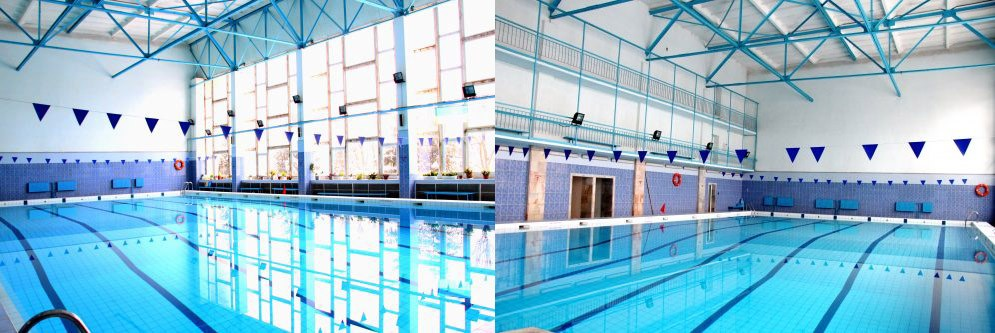
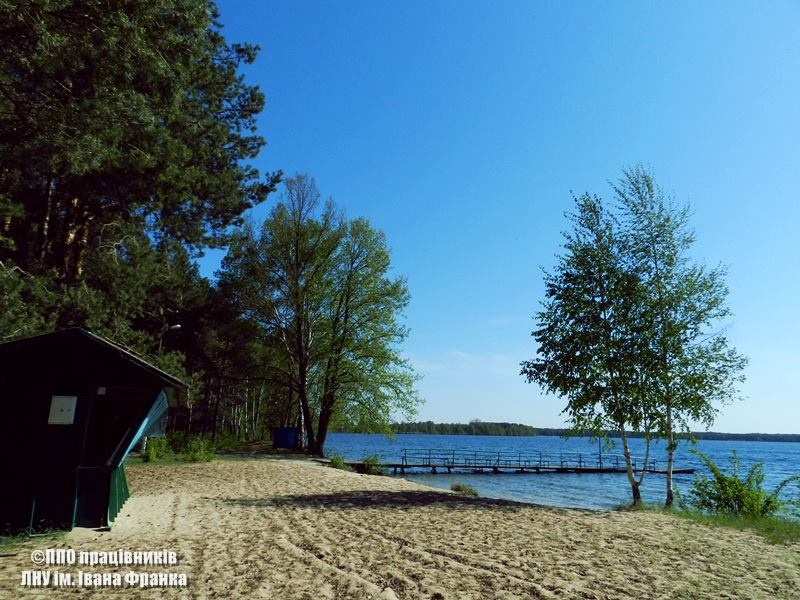
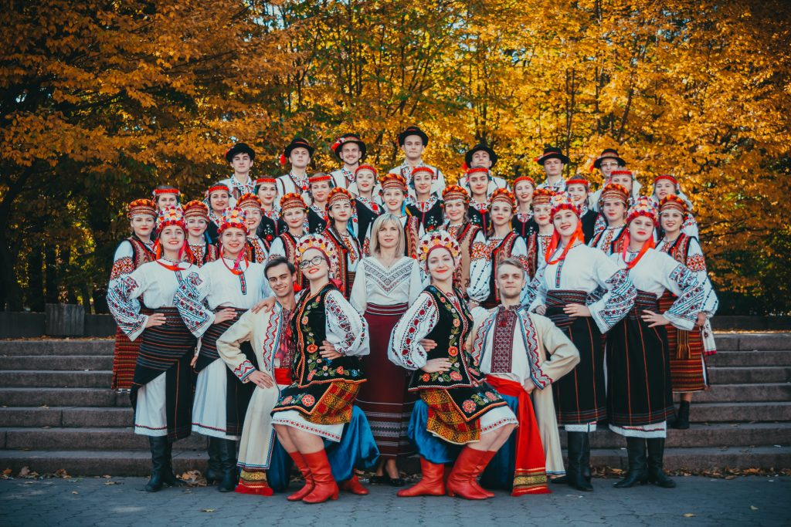
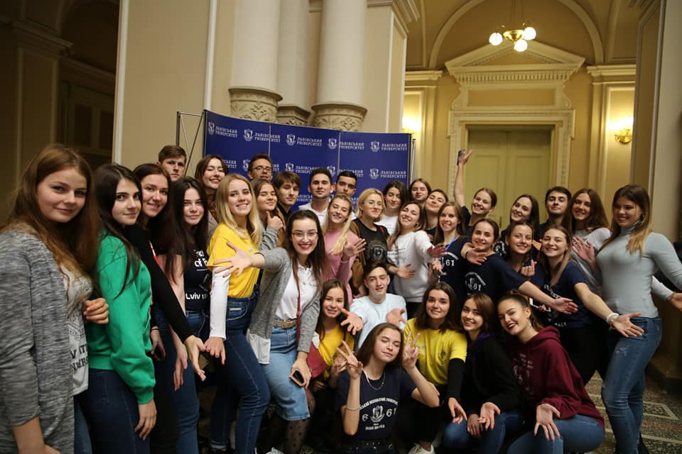

# Гуртки, спорт і дозвілля

## Спортивні секції і гуртки
Студенти Університету в рамках занять з фізичного виховання, або за власним бажанням, мають змогу обрати одну із багатьох спортивних секцій, що ведуться [кафедрою фізичного виховання та спорту](https://students.lnu.edu.ua/sport/):

- ігрові види спорту (баскетбол, волейбол, гандбол, настільний теніс, тощо)
- циклічні види спорту (легку атлетику, спортивне орієнтування, туризм)
- фітнес-аеробіку (шейпінг, ритмічну гімнастику)
- силові види спорту (атлетизм, гирьовий спорт, пауерліфтинг, армспорт)
- плавання, оздоровче плавання та йогу
- єдиноборства (бокс, дзю-до, самбо, карате-до, фехтування, тощо)

У рамках курсу "Фізичне виховання" ви можете відвідувати як звичайні пари, так і обрати секцію, яка подобається вам найбільше. При цьому, варто пам’ятати, що заняття у секціях відбуваються від двох разів на тиждень, а звичайні пари - лише один раз на тиждень.

!!! tip ""
    Якщо ви оберете секцію, ви зможете брати участь у змаганнях з її галузі. Участь і, тим паче, перемога у цих змаганнях можуть надавати вам додаткові бали до стипендіального рейтингу (але це застосовується лише до студентів, що навчаються за кошти державного та/або регіонального замовлення).

## Басейн і секція з плавання
Для фізичного оздоровлення студентів і працівників університету діє басейн, котрий функціонує в навчально-спортивному комплексі. Відвідування басейну студентами можливе в рамках занять з фізичного виховання. У час вільний від занять працівники та студенти нашого університету можуть відвідувати басейн на платній основі.

Детальніше про вартість послуг та інші секції можна дізнатися [за посиланням](http://students.lnu.edu.ua/sport).

## Стаціонари і відпочинок
Наш університет володіє кількома базами оздоровлення та відпочинку, біологічними та географічними стаціонарами у Львівській та інших областях України. Серед них:

- Шацький біолого-географічний стаціонар
- Високогірний біостаціонар у селі Кваси
- Розтоцький ландшафтно-геофізичний стаціонар
- Чорногірський географічний стаціонар
- Лабораторія еколого-геологічних досліджень
- Дністровський географічний стаціонар
- [Та багато інших мальолвничих місць](https://lnu.edu.ua/structure/subdivisions/stations/)

Щороку, студентські організації організовують туристичні та оздоровчі поїздки у ці місця. Також, там проходять навчальні табори, спортивні змагання та інші заходи. Обов'язково слідкуйте за сторінками нашого факультету та університету у соціальних мережах, щоб не проґавити оголошення про збір охочих долучитися до наступної поїздки!

## Центр культури та дозвілля
[Центр культури та дозвілля Львівського національного університету](http://centres.lnu.edu.ua/culture-and-leisure/) діє з метою створення умов для естетичного розвитку особистості, сприяє вихованню у студентської молоді моральних і культурних якостей, національної свідомості, розвитку та пропаганді культури і мистецтва, організації культурного дозвілля та розвитку творчих обдарувань студентів, аспірантів, викладачів та співробітників нашої Alma Mater.

Серед іншого, на базі [Центру культури та дозвілля](http://centres.lnu.edu.ua/culture-and-leisure/) працюють наступні гуртки і колективи:

- [Народний ансамбль пісні і танцю "Черемош"](http://cheremosh.lnu.edu.ua/)
- [Народна чоловіча хорова капела "Прометей"](http://centres.lnu.edu.ua/culture-and-leisure/collectives/prometej/)
- [Народний камерний оркестр](http://centres.lnu.edu.ua/culture-and-leisure/collectives/orkestr/)
- [Народна капела бандуристок "Зоряниця"](http://centres.lnu.edu.ua/culture-and-leisure/collectives/zoryanytsya/)
- [Народний дівочий хор "Ліра"](http://centres.lnu.edu.ua/culture-and-leisure/collectives/lira/)
- [Заслужена хорова капела України "Боян" імені Євгена Вахняка](http://centres.lnu.edu.ua/culture-and-leisure/collectives/zasluzhena-horova-kapela-ukrajiny-boyan-imeni-evhena-vahnyaka/)
- [Народний ансамбль сучасного танцю "Fantazy"](http://centres.lnu.edu.ua/culture-and-leisure/collectives/fantasy/)

Також, на кожному з факультетів нашого університету діють власні гуртки, доєднатися до яких може кожен студент, або навіть працівник. У нас на факультеті, приміром, працює гурток робототехніки, робота якого підтримується Львівським ІТ кластером.

## Громадські організації
У нашому університеті провадять свою діяльність більше 20 громадських організацій, асоціацій, товариств та інших об'єднань. Можливо, вам було б цікаво доєднатися до одного з них? Перегляньте повний перелік цих організацій [на порталі університету](https://lnu.edu.ua/about/public-organizations/), або [доєднайтеся до студентської волонтерської служби](https://lnu.edu.ua/khochu-staty-volonterom/).

