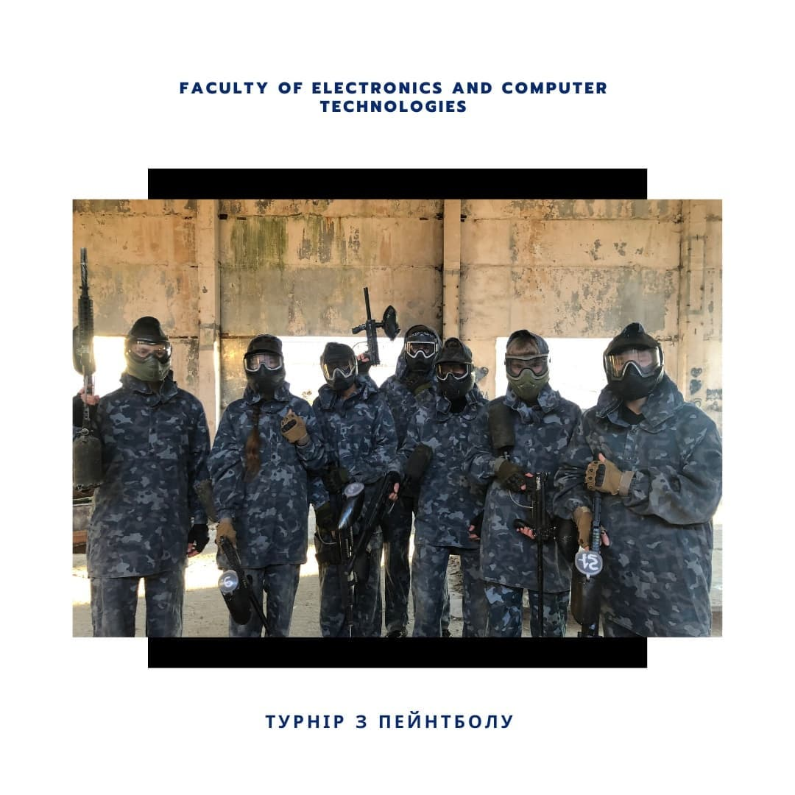
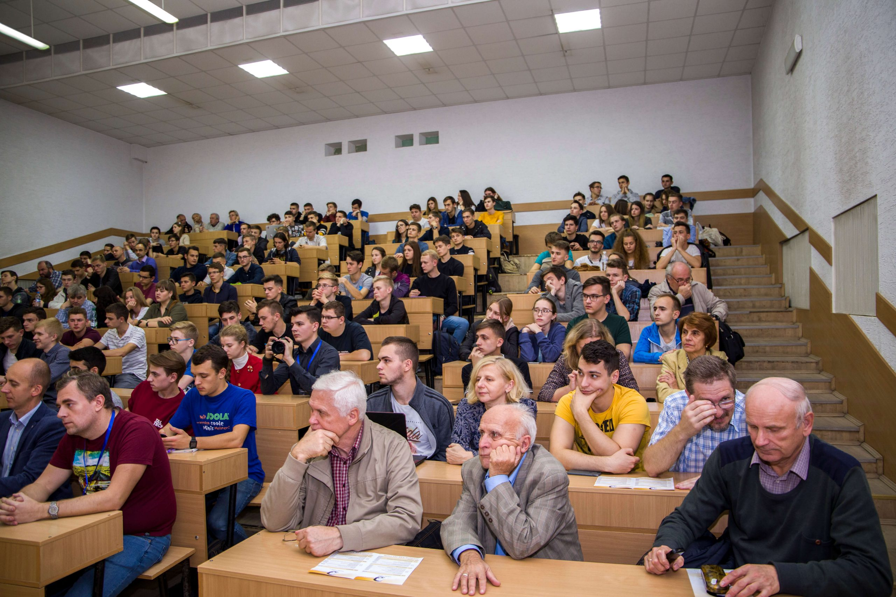
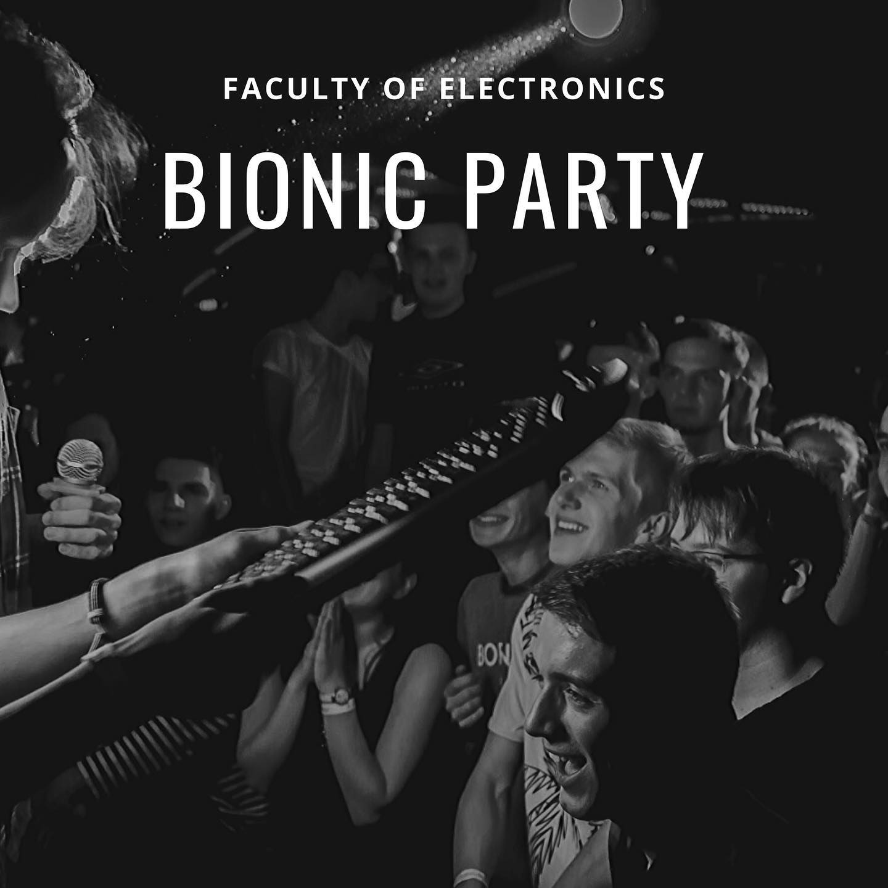

# Заходи на факультеті
На нашому факультеті щороку проводяться десятки різноманітних заходів, серед яких: "Що? Де? Коли?", "Хто зверху?", кіберспортивні турніри, пейнтбольні баталії, освітні заходи і курси від ІТ компаній (наприклад, Cresh Courses від SoftServe чи курси у стінах факультету від Cursor.Education), літні і зимові школи (штучного інтелекту, інженерії даних і безпеки, тощо), студентська ІТ конференція "Franko IT Day". І це - лише мала частина заходів, які відбуваються на нашому факультеті завдяки активній співпраці студентських організацій, адміністрації факультету й університету, а також компаній-представників ІТ сфери.

## Активний відпочинок
Наші студенти вміють не тільки гарно вчитися і добре працювати, а й влаштовують запеклі баталії у кіберспортивних турнірах (Dota, Counter Strike, тощо), переносять їх і на реальні майданчики - проводять пейнтбольні та страйкбольні турніри, [мандрують горами Львівщини](https://facebook.com/xiocompan/posts/2595284577229573) разом з [Іваном Олександровичем Хвищуном](https://facebook.com/xiocompan) та іншими викладачами.

## Franko IT Day
Дні інформаційних технологій у Львівському університеті - мабуть, один з найвідоміших заходів, організований студентами у співпраці з адміністрацією нашого факультету та ІТ компаніями. Він проходить два рази на рік, у форматах офлайн чи онлайн, і щоразу збирає все більше і більше відвідувачів: студентів, представників ІТ компаній, а також школярів випускних класів. Тут можна відвідати лекції на теми штучного інтелекту, машинного навчання, гнучних навичок, програмування, а також представити власні проєкти.

Дізнатися більше про **Franko IT Day** можна [на сайті заходу](https://frankoitday.lviv.ua/).

## Посвята у першокурсники
Обов’язковим до проведення заходом є посвята у першокурсники, про яку ходять легенди й на багатьох інших факультетах нашого університету. Можемо побитись об заклад, що ви почуєте захоплюючі розповіді про цей захід від старшокурсників, а від себе додамо, що тільки взявши участь у ній, можна пізнати "дзен" і стати справжнім ІТшником!

У 2018 і 2019 роках ми об'єднувалися зі студентськими організаціями біологічного факультету, щоб разом проводити круті посвяти для наших факультетів. Ми орендували нічний клуб, щоб наші студенти могли відсвядкувати свій вступ і драйвово відпочити у затишній і безпечній атмосфері. У 2021 році, у зв'язку з епідеміологічною ситуацією, ми провели виїзну посвяту у студенти у Карпатах з дотриманням усіх карантинних вимог.

!!! danger ""
    У зв'язку з повномасштабним вторгненням російської федерації в Україну і введенням воєнного стану на всій території нашої країни, проведення урочистих заходів у 2022-2023 навчальному році буде значно обмеженим задля безпеки студентства. Просимо поставитись до цього із розумінням!

## Інші факультетські заходи
Звіти про проведені і заплановані заходи для студентів і гостей нашого факультету можна переглянути на наших сторінках в соціальних мережах [Instagram](https://instagram.com/electronics_lnu/), [Telegram](https://t.me/electronics_lnu) і [Facebook](https://facebook.com/electronics.lnu). Також, там з'являються всі важливі новини щодо освітнього процесу, тож радимо уважно слідкувати за ними. Крім цих сторінок, ми також маємо [канал на YouTube](https://youtube.com/channel/UCrKI0wrgSLhqOUESLiTk4UA), де ви можете переглянути записи наших минулих подій.