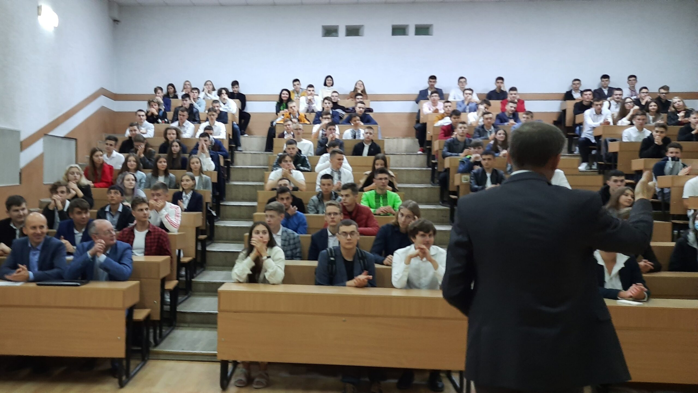

# Початок чогось більшого
**Студентське життя** - це, мабуть, найбільш швидкоплинний, і при цьому найцікавіший і найдрайвовіший період життя кожної людини. Саме тут і зараз ви знайдете людей, з якими будете пов'язані протягом всього свого життя. Саме тому, університет і факультет неабияк вкладаються у створення додаткових можливостей для самореалізації студентів - через [гуртки і спортивні секції](./circles.md), [різноманітні заходи](./events.md), змагання і [міжнародні програми](./international.md).

Також, активні студенти об'єднуються у [самоврядних організаціях](./organizations.md), таких як Студентський уряд і Первинна профспілкова організація студентів, що дає можливість безпосередньо впливати на ті рішення, які приймаються адміністрацією нашого навчального закладу.

Цей розділ [Faculty Guide](../../index.md) покликаний допомогти тобі знайти ті заняття, які були б цікавими і корисними для тебе, щоб зробити твої студентські роки незабутніми і продуктивними, повними нових відкриттів, перемог, корисних знайомств, і щоб все це наближало тебе до реалізації твоїх найпотаємніших планів і бажань - заради майбутнього нашої країни :ua:.

