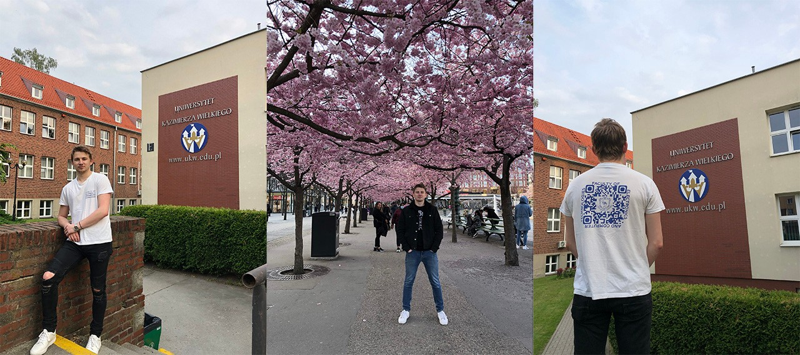

# Міжнародні програми
Львівський національний університет, як один з найстаріших та найавторитетніших закладів вищої освіти, провадить міжнародну діяльність, і співпрацює з ключовими освітніми установами по всьому світу. Під час навчання, ви можете брати участь у міжнародних програмах обміну студентів, аспірантів й викладачів і стажуваннях.

!!! tip ""
    Прочитати про досвід Андрія Орлова, студента нашого факультету, який влітку 2021 року завершив своє стажування по програмі Erasmus+, можна на офіційному сайті факультету - [за цим посиланням](https://electronics.lnu.edu.ua/news/pro-prohramu-akademichnoi-mobilnosti-erasmus-vid-pershoho-lytsia-andriy-orlov).

## Як долучитися до стажування?
Якщо вам цікаво розвиватися у цьому напрямку — завітайте на офіційний сайт [Відділу міжнародної співпраці](https://international.lnu.edu.ua/) (так званого "International office") нашого університету, щоб дізнатися умови участі у таких активностях. Загальною вимогою є навчання як мінімум на другому курсі, тож у вас є час на те, щоб придивитися до усіх доступних програм.