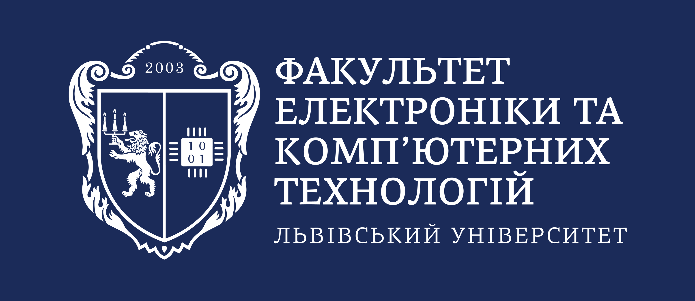

# { width="100%" }

**Привіт-привіт :vulcan_tone1:!** Вітаємо тебе зі вступом на [Факультет електроніки та комп’ютерних технологій](https://electronics.lnu.edu.ua/) :rocket:! Бажаємо, щоб наступні 4 роки навчання на бакалавраті, або 1.5 роки магістратури у нашій Alma Mater[^1], були не тільки продуктивними у плані навчання, але й сповненими цікавих пригод, корисних знайомств, а також веселощів - як же без них!

**На тебе чекає новий світ**, ніяк не схожий на шкільне життя, тому не зволікай — доєднуйся до нашої дружної факультетської родини вже зараз, а ми тобі у всьому допоможемо :sunglasses:!

[^1]: Згідно з [Вікіпедією](https://uk.wikipedia.org/wiki/Альма-матер), **Alma Mater** - це старовинна студентська алегорична назва університету чи коледжу. У переносному значенні — місце, де хтось виховувався, набув професійних навичок.

## Канали зв'язку і корисні посилання
Приєднайся до [каналу факультету в Telegram](https://t.me/electronics_lnu), де ти зможеш дізнатися про важливі події у студентському житті, переглянути можливості для розвитку і цікаві пропозиції від крутих ІТ компаній. Також у нас є сторінки в [Instagram](https://instagram.com/electronics_lnu) (там цікаво) і [Facebook](https://facebook.com/electronics.lnu) (там офіційно). Ще у нас є [канал на YouTube](https://youtube.com/channel/UCrKI0wrgSLhqOUESLiTk4UA) - там публікуються записи подій на факультеті, а також сторінка у TikTok - але її шукай самостійно, бо автор цих рядків там не зареєстрований :laughing:.

[Telegram-канал](https://t.me/electronics_lnu){ .md-button .md-button--primary }
[Чат вступників](https://t.me/+gqvk1OZJKPlmOTZi){ .md-button .md-button--primary }
[Instagram](https://instagram.com/electronics_lnu){ .md-button }
[Facebook](https://facebook.com/electronics.lnu){ .md-button }
[YouTube](https://youtube.com/channel/UCrKI0wrgSLhqOUESLiTk4UA){ .md-button }

## :books: [Про навчання, сесію і стипендії](for-freshmen/education/index.md)
У цьому розділі ми розповімо тобі про формування академічних груп, навчимо "читати" розклад занять, розповімо про види дисциплін і занять, форми і види оцінювання знань, сесійний контроль і отримання стипендій. Обіцяємо: нудно не буде - ну, можливо :face_with_monocle:!

[Перейти до прочитання](for-freshmen/education/index.md){ .md-button .md-button--primary }

## :house_with_garden: [Наші гуртожитки і проживання у Львові](for-freshmen/residence/index.md)
З цього розділу ти дізнаєшся про процес поселення гуртожитки нашого університету, вартість проживання, отримаєш кілька важливих порад і огляд місць коло гуртожитку, які можуть тебе зацікавити. Крім того, ми розповімо про деякі моменти проживання у Львові, які можуть бути цікавими навіть для тих, хто проміняв гуртожиток на оренду квартири :sob:.

[Перейти до прочитання](for-freshmen/residence/index.md){ .md-button .md-button--primary }

## :partying_face: [Дозвілля і драйвове студентське життя](for-freshmen/lifestyle/index.md)
Вривайся у драйвове студентське життя на твоєму факультеті, організуй своє дозвілля - щоб воно було не тільки цікавим, але й корисним для тебе. Віримо, що цей розділ Faculty Guide стане твоїм путівником у захоплюючий світ студентства :student_tone1:.

[Перейти до прочитання](for-freshmen/lifestyle/index.md){ .md-button .md-button--primary }

## Встановлення застосунку на смартфон
Для зручності і миттєвого доступу до усіх матеріалів [Faculty Guide](index.md), радимо вам встановити його як застосунок на ваш мобільний девайс. Це можна зробити, відкривши меню браузера :material-dots-vertical:, де обрати пункт ":material-cellphone-check: Додати на головний екран", і у вікні, що з'явилося перед вами, підтвердити встановлення застосунку. Треба зазначити, що для його використання все одно потрібно мати доступ до мережі Інтернет.

!!! check "Допомога з розвитком цього порталу"
    Якщо ти хочеш допомогти з розвитком [Faculty Guide](index.md), завітай до [репозиторію проєкту на GitHub](https://github.com/electronics-lnu/faculty-guide). Там ти знайдеш всю необхідну інформацію щодо того, як саме ти можеш допомогти, і що для цього потрібно зробити. Ми потребуємо допомоги від всіх, хто може покращити зміст викладених тут матеріалів, щоб вони були завжди актуальними і зрозумілими для всіх студентів.
